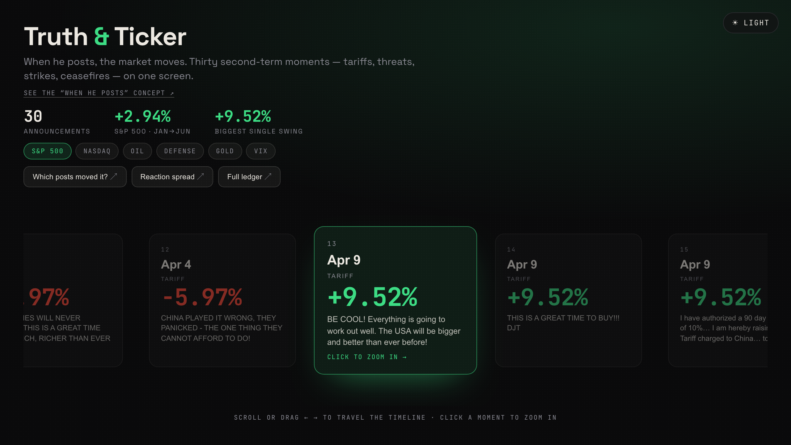

# TRUTH & TICKER

[](https://github.com/andrewli8/truth-and-ticker/actions/workflows/ci.yml)



A single-screen interactive **hub** correlating Donald Trump's public announcements
across his **second term (Jan–Jun 2025)** — tariffs, threats, strikes, ceasefires,
Fed pressure — with the U.S. markets that moved on them: the S&P 500, the Nasdaq,
the Dow, oil, defense names, gold, and the VIX. The whole term sits on one screen as a
horizontal filmstrip you travel by scroll / drag / arrow keys; clicking a moment zooms
it into a focused detail layer.

The framing is deliberate: **timing correlation, not accusation.** Each verified
announcement timestamp is laid against the verified market reaction that
followed, with a citation on every event. The pattern is the argument. The
reader judges it.

## Stack

- **Vite + React + TypeScript** — the main site is one screen (`src/hub/`); the
  standalone "When he posts" concept is a second Vite entry (`/poc.html`)
- **GSAP (`useGSAP`)** — the POC's entrance + the hub's filmstrip transitions, all
  reduced-motion safe
- **D3 (d3-scale / d3-shape)** — math only; the chart is hand-rolled SVG for full
  control of the line-draw reveal, playhead, and dot
- **Vitest + Testing Library** — unit + component + dataset-integrity tests
- **Playwright** — E2E smoke suite for critical flows (`npm run test:e2e`), kept
  outside the `verify` gate

## Develop

```bash
npm install
npm run dev       # local dev server
npm run test      # vitest
npm run verify    # tsc --noEmit && vitest run && vite build  (the looptight gate)
npm run test:e2e  # Playwright E2E smoke suite (real Chromium; outside the gate)
npm run build     # production build to dist/
```

## How it works

- `src/data/announcements.json` — verified announcement timeline (verbatim
  quotes, ET timestamps, type, citation).
- `src/data/markets.json` — daily close series per instrument.
- `src/lib/correlate.ts` — joins each announcement to its **close-to-close**
  market reaction (the close before vs. the reaction close after), null-safe.
- `src/lib/stats.ts` `reactionByType` — averages those reactions by announcement
  category, powering the **CategoryBand** ("which posts moved <instrument>?");
  `topReactions` ranks the biggest cross-instrument single-day moves for the ledger's
  "biggest single-day reactions" highlight; `reactionSpread` powers the **ReactionSpread**
  distribution plot ("most posts nudge the market, a few move it hard").
- `src/hub/` — the single-screen **hub** (`HubApp`): a horizontal **Filmstrip** of all 30
  announcements (scroll / drag / arrow keys), an instrument switcher, and summary stats.
  Clicking a moment opens **EventZoom**; the topic chips open **BreakdownZoom** (CategoryBand
  / ReactionSpread / the ledger).
- `src/components/MarketChart.tsx` — pure SVG renderer driven by a `progress` prop
  (ghost full line + bright revealed line + playhead + dot), used by EventZoom at full
  reveal; it labels the announcement's own data point with a hollow ring + its close-to-close
  reaction (shared `ChartReactionLabel`) so the move reads on the line.

See [`src/data/SOURCES.md`](src/data/SOURCES.md) for data provenance and caveats.

## The "When he posts" concept (`/poc.html`)

Alongside the hub, the repo ships a standalone one-screen
interactive concept at **`/poc.html`** (`src/poc/`, a second Vite entry — see
`vite.config.ts`). It distills the whole thesis into a single full-bleed view: a chosen
market across the second term as a glowing line you scrub by **dragging or with the
arrow keys**, with the reaction readout and the entire scene's accent colour flipping
green/red to the active post's gain or loss. An **instrument switcher** (the six markets
of `src/lib/instruments.ts`, defaulting to the S&P 500) re-plots the line — so the same
post can read green on one instrument and red on another. It reuses the real data and the
same pure chart helpers (`scales`, `correlate`) as the main app, adds an awwwards-grade
GSAP entrance (line draw-on, masked kinetic title, count-up readout, lerp-follow
cursor — all reduced-motion safe), and is covered by unit (`src/poc/__tests__`) and
real-browser E2E (`e2e/poc.spec.ts`) tests. It's linked from the Outro footer.

## Source

Live on GitHub: **<https://github.com/andrewli8/truth-and-ticker>** (`main`).

## Design & methodology docs

- Architecture & data flow: [`docs/ARCHITECTURE.md`](docs/ARCHITECTURE.md)
- Accessibility posture: [`docs/ACCESSIBILITY.md`](docs/ACCESSIBILITY.md)
- Data provenance & methodology: [`src/data/SOURCES.md`](src/data/SOURCES.md)
- Spec: `docs/superpowers/specs/2026-06-27-truth-and-ticker-design.md`
- Plan: `docs/superpowers/plans/2026-06-27-truth-and-ticker.md`
